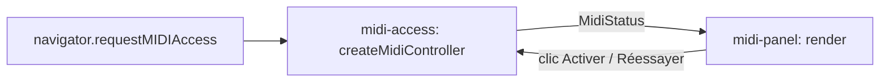

> Generated by /vibe:docs — manual edits will be overwritten; use README for hand-written content.

# Architecture

La page est composée de trois modules dans `src/`, plus l'amorçage.

| Module | Rôle |
|---|---|
| `midi-access.ts` | Demande l'accès Web MIDI, calcule l'état (`MidiStatus`) et suit les branchements à chaud. Aucun accès au DOM. |
| `midi-panel.ts` | Dessine l'état dans la page et annonce les changements dans une zone `role="status"`. |
| `midi.ts` | Utilitaires MIDI purs (numéro de note → nom). |
| `main.ts` | Relie le contrôleur au panneau. |

## États

`idle` → `requesting` → `ready` (liste des entrées, annonce du dernier changement) ou `denied` (refus, pas de nouvelle demande) ou `error` (échec inattendu, « Réessayer » permis). `unsupported` est décidé dès le départ quand Web MIDI est absent.

## Choix de conception

- L'environnement (`MidiEnvironment`) est injecté dans le contrôleur : les tests simulent le navigateur sans matériel.
- Le panneau n'utilise que `textContent`, jamais de HTML brut : un nom de périphérique ne peut pas injecter de balises.
- Seules les entrées connectées (`type: input`, `state: connected`) sont listées.
