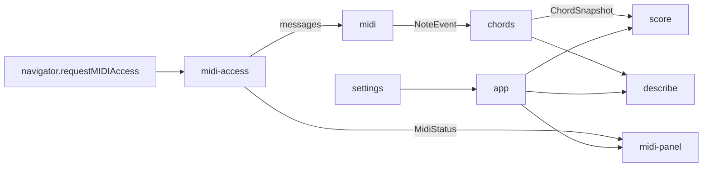

> Generated by /vibe:docs — manual edits will be overwritten; use README for hand-written content.

# Architecture

La page est écrite en TypeScript sans framework. La logique pure est séparée du DOM : seuls `app`, `midi-panel` et `score` touchent la page.

| Module | Rôle |
|---|---|
| `main.ts` | Charge les styles, branche le navigateur réel (`browserMidiEnvironment`, `localStorage`) et monte l'application. |
| `app.ts` | Assemble la page : barre MIDI, partition, commandes (Figer, Effacer, Options), annonces vocales, raccourcis. |
| `midi-access.ts` | Demande l'accès Web MIDI, calcule l'état (`MidiStatus`), suit les branchements, filtre sur le piano choisi (`select`) et transmet les messages de notes. |
| `midi-panel.ts` | Dessine la barre MIDI et la liste de choix du piano, scène d'état (activation, erreurs, aide, bandeau « débranché »). |
| `midi.ts` | Décode les messages MIDI bruts en `NoteEvent`. |
| `chords.ts`, `held-notes.ts` | Notes tenues, regroupement en accords (60 ms), historique borné, effacement et restauration. |
| `staff.ts` | Place une note sur la portée (clé, altération, nom français, clé VexFlow). |
| `score.ts` | Dessine les deux portées avec VexFlow (8 emplacements). |
| `describe.ts` | Décrit les accords en toutes lettres pour les lecteurs d'écran. |
| `settings.ts` | Réglages mémorisés dans `localStorage`. |
| `strings.ts` | Tous les textes en français. |

## Choix de conception

- L'environnement (`MidiEnvironment`, `Storage`, horloge) est injecté : les tests simulent le navigateur sans matériel.
- Le DOM est construit avec `textContent` uniquement, jamais de HTML brut.
- Les styles passent par des variables CSS (`src/styles/tokens.css`) ; `score.ts` les lit pour colorer le SVG.
- Le rendu de la partition est regroupé par image d'affichage (`requestAnimationFrame`), pas un rendu par message MIDI.
